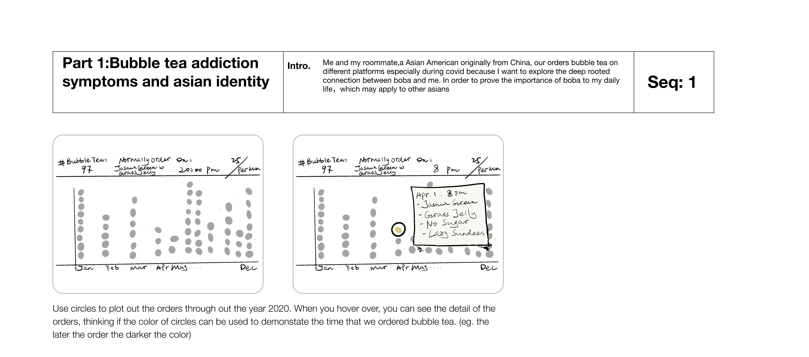

Boba Generation
By Luella Lu

# Main idea:
## Who is the person, demographic, or processional group you are designing for. What do they know about your project already?
	The audience is people who want to learn more about the bubble tea phenomenon surging across the globe, especially in countries with a large asian diaspora.
## How is your audience reading your project. In what situation, modality, through which distribution channel, and in what context?
	The audience is reading the project through a website, having stumbled upon it through a web search seeking to learn more about the history, culture, and future of bubble tea.
## What does your project ask of your audience, what do they need to do (input, interact, act)?
	The audience should come with a willingness to learn and process information presented to them in a mostly static but still interactive website through hovering, clicking, small minigames, and an interactive map.
## What does your audience take away, instantly, after 1min, 5min of engagement?
	That the topic of bubble tea is far more nuanced than just a passing fad of the last decade. After 5 minutes, they should be able to appreciate the cultural nuance provided by bubble tea to society, especially when viewed from the point of view of the asian diaspora. 
## Conceptual Question
	What is the significance of bubble tea as a cultural icon and phenomenon, especially when it relates to the asian american community? 
## Conceptual Significance
	Bubble tea represents more than just a drink to the asian-american community, it represents something that gives members of that community acceptance in an otherwise unfriendly environment existing as foreigners. It brings them together and gives them something that constitutes a guaranteed shared experience, something that helps forge bonds and hold things together during otherwise turbulent years of finding your way in broader society.
## Practical Application 
	To raise awareness of the struggles that immigrants face on a daily basis, something as simple as a drink can become a rallying focal point for a subset of the immigrant community and help them form their identities in society. 
 
# Data Sources:
## Survey 
## Personal
	Credit card transaction history
	UberEats
	Doordash
	Seamless
Personal data given in the form of a csv from each of the sources. 
They all include common variables such as:
	Restaurant name
	Order
	$ spent
	Time of order
This data will be further processed:
	Filter data for only bubble tea related orders
	Categorize the bubble tea orders into subsets 
		Type of bubble tea ordered
		Toppings included
		Special requests (sugar, ice level)
	Categorize the time of order into groups (ie, morning, afternoon, evening)
	
## Public
### Yelp
		Includes the following key variables:
			Restaurant name 
			Category
				Filter the dataset for restaurants tagged as bubble tea
			Address
				Convert this data into gps coordinates to be used in an interactive map
			Review Score / Reviews
				Natural language processing on reviews, sort restaurants by their average review score
### Twitter / Instagram
		Includes the following key variables:
			Hashtags
				Posts are searched out via bubble tea related hashtags
			Text content
				Natural language processing to pull out social media impression of bubble tea
			Time of post
				Organize data chronologically to view a timeseries
			Likes/retweets
			Location
				Not availalble for all data points - convert available into gps coordinates to be used in an interactive map
### Market report
		Report not currently available - to be updated
### Google trends
		Includes the following key variables:
			Search term
			Number of searches per time frame 
			General location the search originated from				

# Storyboard

# Introduction
Bubble milk tea originated in Taiwan and spread across the cities and suburbs of the U.S. in the 1990s; however, it did not become popular until the 2000s. This was the drink that have helped some Asian American youth to navigate the waters of community identity. It was the drink of choice for some Asian American college and high school students who want a comfortable setting to relax, talk, and forge a sense of community. It was difficult for Asian American youth to just hang out in public urban spaces in groups without arousing suspicion from law enforcement officers due to their use of import cars and the type of clothing they wear. A boba shop was "forged from transnational exchanges of cuisines, aesthetics, and media", a place where "Asian American youth, from a wide assortment of ethnicities, participate in a hybridized experience."
 
## Part 1: Bubble tea addiction symptoms and our asian identity
### Data: Personal, Survey

Me and my roommate,a Asian American originally from China, our orders bubble tea on different platforms especially during covid because I want to explore the deep rooted connection between boba and me. In order to prove the importance of boba to my daily life，which may apply to other asians
Business name, categories that the business fall into, location (gps data), reviews

## Part 2: Bubble tea, Boba or Zhenzhu naicha(Pearl Milk tea)
### Data: Survey, Yelp, Twitter / Instagram, Market report, Google trends	
Origins in  Taiwan. The essential naming and component of Bubble tea

## Part 3: Boba generation: you grow out of Boba
### Data: Survey, Yelp, Twitter / Instagram, Market report, Google trends	

Change of boba industry from immigrant generation to second generation 
Before 2005, most milk tea shops such as Quickly's and Lollicup, were using flavored powder/syrup and tea bags to make their bubble milk teas. However, as more Americans begin to consume bubble milk tea, more traditional milk tea shops begin to appear. These traditional milk tea shops use loose tea leaf, milk, honey, and natural sweeteners to make their drinks. 
The trend cooled down a little bit in the early 2000s, and then experienced a resurgence when places like Boba Guys opened up, offering high-quality teas, real milk, and a comfortable, casual atmosphere. Chin also theorizes that as drinks like aloe juice and coconut water, both of which can have jellied remnants in them, have risen to prominence, "people are becoming more used to having chewy bits in their drinks."
Still, he's surprised that bubble tea has managed to capture the imaginations of so many American consumers in such a relatively short period of time. He compares it to sushi, starting as a foreign tradition but eventually being absorbed fully into American food culture. "If I told people twenty years ago that one of the most popular beverages would be a tea they could chew, they'd be very skeptical," he says. Fortunately, Chin's bet on tapioca balls paid off, and given the last decade, it's likely that the trend will only continue to spread across the globe. "Boba bridges cultures," he tells me.
 
## Part 4: Boba in US: Boba map for all
### Data: Survey, Yelp, Twitter / Instagram, Market report, Google trends
Current and forecasting(?) of bubble tea market in US

