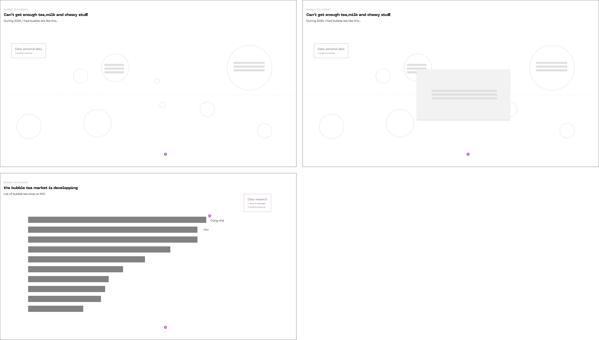

# Lets get Boba.
### it is popular but is it a ubiquitous social network friendly mark for Asian Identity?

## intro
Bubble milk tea originated in Taiwan and spread across the cities and suburbs of the U.S. in the 1990s;

## Part1:first generation of bubble tea by immigrants
the elements of classic bubble tea: name, tea,tapioca,sugar,etc

## Part2: bubble tea market is booming in U.S and I drink a lot bubble tea as well
personal data especially during 2020 and top 10 bubble tea shops at NYC to indicate that people drink more than classic bubble tea nowadays.
this section serves as a transition part.
Data: Personal data, market research

## Part3: why it is popular?
Reason1: Fully customizable, bubble tea nowadays stands for more than tea/milk tea, can basically combine flavored liquid base with toppings.
Data: menu from yelp

## Part4: why it is popular?
Reason2: Easily instagramable:  lots of hashtags and color analysis of the bubble tea posts
Data: instagram tags, posts

## Part5: why it is popular?
Reason3: Americanized? use better ingredients to tailor with people's needs 
No body mentioned about Asian Identity
Data: yelp reviews

## Part6: Can you relate bubble tea with asian identity?
Continue from the previous part, Asians, especially Asian American do think bubble teashop is a social interaction place. However, in terms of Asian Identity, to my surprise, a lot of asian american refused to relate their identity with a pop drink.
Brought up a term called: boba liberalism 
Data: survey, twitter
